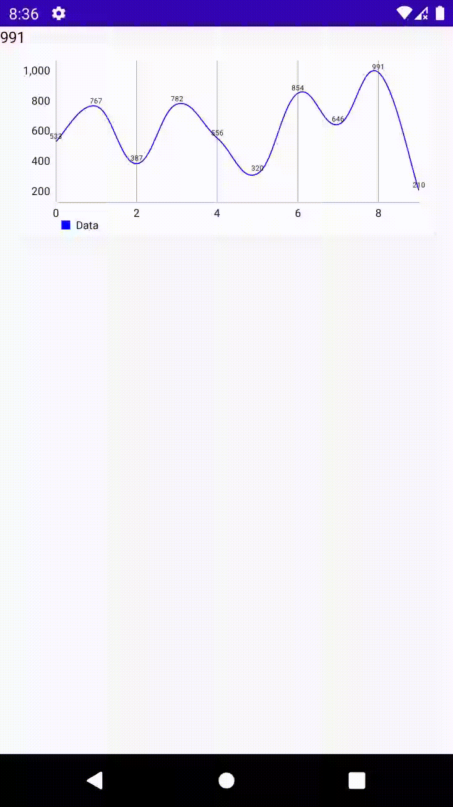

# Graph visualization: Android, Compose, MPAndroidChart + Docker, NodeJS, WEBSockets



This is an example of a client-server connection created using websockets with the socket.io library. The connection is established between an Android app and a Node.js server. On the Android side, the app integrates Compose, the new UI library for Android, along with MPAndroidChart, a powerful library for rendering charts. The app also uses the socket.io library to listen for events emitted from the server. On the server side, the Node.js app runs as a Docker container and establishes the socket connection using the socket.io and express libraries.

# How to run the Docker container in Windows?
You must install docker in your os. Once docker is installed open the following commands from terminal:

- Open powershell and locate the terminal in the NodejsServer folder:
    ```
    cd /NodejsServer
    ```
- Build the container:
    ```
    docker build -t nodejs_socket_container .
    ```
- Run the container:
    ```
    docker run -it -p 3000:3000 --volume ${PWD}/app:/app --name=nodejs_socket_container --rm nodejs_socket_container
    ```

# How to run the Docker container in Linux/Mac?
You must install docker in your os. Once docker is installed open the following commands from terminal:

- Open your terminal and locate in the NodejsServer folder:
    ```
    cd /NodejsServer
    ```
- Build the container using the scripts created:
    ```
    ./scripts/build
    ```
- Run the container:
    ```
    ./scripts/run
    ```

## Expose the API with ngrok
1. Create a ngrok account at https://ngrok.com/.
2. Choose the best option to install ngrok in your OS: https://ngrok.com/download
3. Get the auth token (https://dashboard.ngrok.com/get-started/setup) to run ngrok with the following command:
```
ngrok config add-authtoken <your token>
```
4. Run ngrok:
```
ngrok http 3000
```
5. Copy the url generated from ngrok (this url is different each time you run ngrok):

6. Go to AndroidApp and find the [MainViewModel.kt](./AndroidApp/app/src/main/java/com/aldajo92/graphwebsockets/MainViewModel.kt) file. Replace the url in the following line with the url generated from ngrok:
```kotlin
mSocket = IO.socket(
    "https://e454-167-0-177-4.ngrok-free.app" // <--- Replace
)
```


# Author
Alejandro Daniel José Gómez Flórez (aldajo92)
